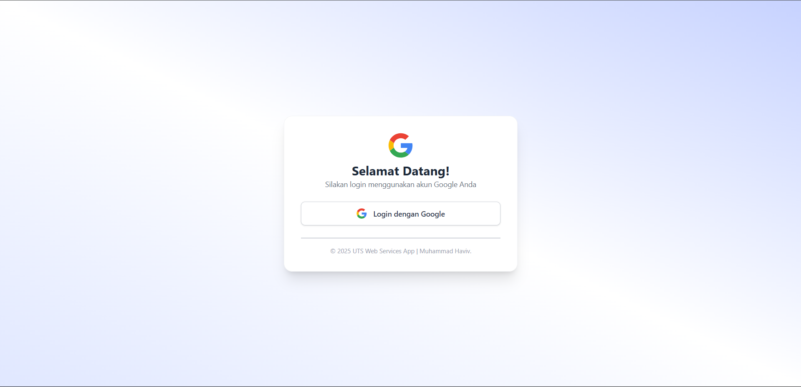
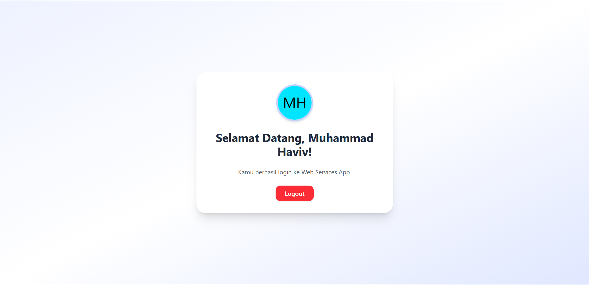

# 🌐 Web Services Application - UTS Project

A simple yet elegant **Laravel application** that supports **Google OAuth login** and features a personalized user **dashboard with avatar integration**, built using **Tailwind CSS** and **Preline UI** for a clean and responsive interface.

> 🧑‍💻 Developed by Muhammad Haviv — UTS Web Services Project.

---

## 📸 Preview

| Login Page | Dashboard |
|------------|-----------|
|  |  |

---

## 🔑 Features

- 🔐 **Google OAuth Login** via Laravel Socialite
- 🎨 Responsive UI with **Tailwind CSS** and **Preline Components**
- 🧍‍♂️ Dynamic User Avatar using [ui-avatars.com](https://ui-avatars.com)
- 💬 Personalized greeting on dashboard
- 🚪 Secure logout functionality
- ✨ Clean, modern UX for authentication flow

---

## 🧰 Tech Stack

| Technology      | Description                                  |
|-----------------|----------------------------------------------|
| Laravel 10.x    | PHP framework for backend logic              |
| Blade Templating| Simple yet powerful Laravel view engine      |
| Tailwind CSS    | Utility-first CSS framework                  |
| Preline UI      | Tailwind-based component library             |
| Laravel Socialite| Google OAuth authentication package         |
| Alpine.js       | Lightweight JS framework for UI interactions |

---